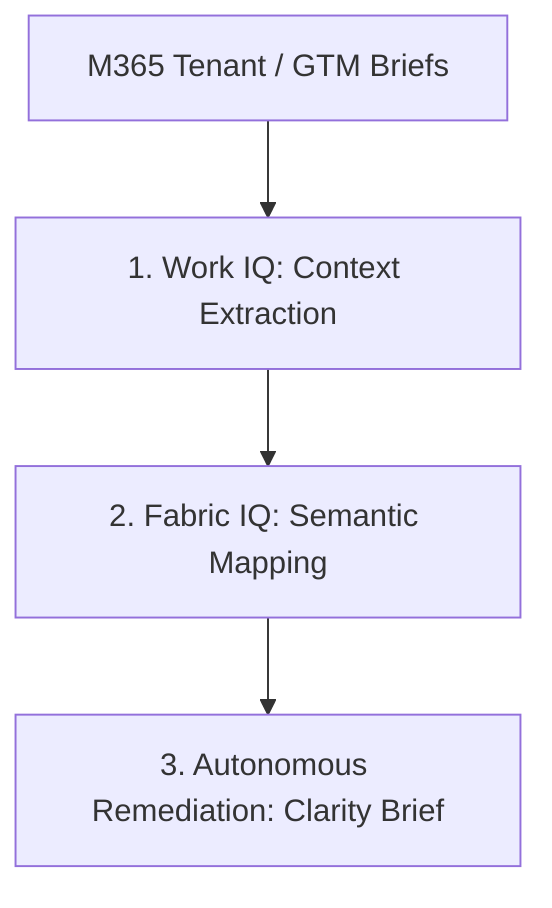

# Compliancy-IQ 🌐✈️
### International GTM Deployment & Cross-Border Operations Agent
*A Native No-Code Architecture for Microsoft 365 Copilot*

---

## 🎯 Project Overview
Global Go-To-Market (GTM) product launches are high-stakes operations where execution velocity collides with extreme regulatory fragmentation. A minor compliance or operational friction—such as non-compliant localized Visual Merchandising, prohibited ingredient listings on digital layouts, or regional labor law constraints regarding store activations—can instantly trigger cross-border customs bottlenecks, shipment rejections, and multi-million-dollar distribution delays.

**Compliancy-IQ** is a mission-critical infrastructure agent designed to secure international GTM deployments. Implemented as a native, no-code configuration within **Microsoft 365 Copilot**, it structuralizes the operational flow between global Headquarters (HQ) and local regional entities. Compliancy-IQ continuously audits launch readiness against local market regulations, turning cross-border operational complexity into immediate, decision-ready execution.

---

## ⚙️ Cross-Border Architecture & Multi-Step Reasoning

### 1. Cross-Border Context Extraction (WORK IQ INTEGRATION)
Upon specific user triggers or within designated GTM project spaces, the agent securely maps operational assets across the corporate tenant. It parses authorized GTM campaign briefs, localized product listings, storefront merchandising layouts, and dedicated multi-country stakeholder threads (emails, Teams updates) to establish a unified operational timeline—strictly respecting corporate data privacy policies and tenant data isolation.

### 2. Semantic Regulatory Mapping (FABRIC IQ ORCHESTRATION)
Utilizing enterprise ontologies, Compliancy-IQ leverages Fabric IQ to map the company’s core operational data matrix (linking product lines, shipping destinations, and supply chain hubs). The agent cross-references this sessional business data with a dynamically updated knowledge graph of local market regulations (consumer laws, advertising standards, and storefront disclaimer requirements) to contextualize risk before it impacts physical distribution.

### 3. Governed Operations Remediation (HUMAN-IN-THE-LOOP CONTROL)
Instead of flagging generic errors or taking unilateral autonomous actions that could disrupt supply chain systems, Compliancy-IQ operates under a strict Human-in-the-Loop architecture. It isolates the precise friction point and injects a prioritized "Clarity Brief" as a native Microsoft Adaptive Card directly into the Regional Operations Manager’s Copilot Chat.

This empowers human leaders to instantly review the compliance gap, evaluate the localized supply chain impact, and execute approved, compliant alternatives generated by the agent in seconds.

---

## 📖 Real-World Use Case: Miami Retail Launch

* **Context:** A global novelty product line deployment heading to the Florida regional market.
* **Incident Detection:**
  * **Finding:** Missing mandatory state-level liability disclaimers for active storefront promotions and pricing claims in the Florida region.
  * **Grounded Legal Source:** Florida Deceptive and Unfair Trade Practices Act (FDUTPA) — FL Stat. § 501.204.
  * **Supply Chain Impact:** Localized Visual Merchandising (VM / PLV) kits corresponding to this campaign at the "Le Vaudreuil" production plant are placed on a temporary, strict shipment hold to mitigate immediate compliance penalties and legal exposure.
* **Human-in-the-Loop Resolution:** The Regional Operations Manager receives the Adaptive Card in Teams, clicks [Generate Alternatives] to automatically inject the missing localized legal text into the visual assets (VM / PLV), and approves the remediation—releasing the inventory hold at the plant in 4 seconds.

---

## 📊 Enterprise Value & Operational Impact

* **Velocity:** Accelerates cross-departmental alignment (Legal, Operations, Marketing, and Supply Chain) from weeks to seconds during complex, simultaneous multi-country novelty cycles.
* **Grounded Security:** Built with native permission enforcement via Microsoft IQ layers, guaranteeing 100% cited, verifiable answers directly anchored in corporate tenant data and official legal frameworks—completely eliminating hallucination risks.
* **Governed Human Oversight:** Ensures absolute operational safety. The agent acts as an elite analytical copilot, but final execution, compliance verification, and inventory release always remain under sovereign human management.

---

## 🛠️ Deployment Framework (No-Code Configuration)

This enterprise agent is structured to be configured natively within **Microsoft Copilot Studio**:

* **Trigger:** Initiated automatically by file updates in the global GTM SharePoint repository or by direct conversational queries in Microsoft 365 Copilot.
* **Knowledge Actions:** Leverages **Work IQ** for secure organizational memory extraction and **Fabric IQ** for operational data ontologies mapping local customs and advertising laws.
* **Output:** Delivers automated, native Microsoft Adaptive Cards ("Clarity Briefs") directly into regional managers' chats for immediate, human-approved, clickable remediation and workflow release.

---
*Designed and engineered by Lesly Matsouma for the Microsoft Agents League Hackathon.*
